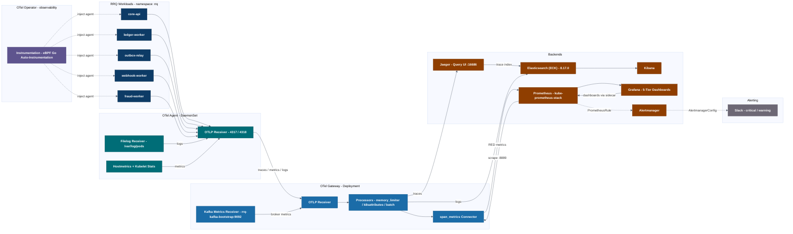

# RRQ Observability Stack

This directory contains the complete observability platform for the **RRQ (River Rust Queue)** payment processing core: OpenTelemetry collection, Prometheus metrics, Grafana dashboards, centralized logging, and distributed tracing — all deployed declaratively via GitOps (Argo CD, Wave 1).

---

## Architecture

### Data Flow Summary

| Signal | Collection | Pipeline | Destination |
|--------|-----------|----------|-------------|
| **Traces** | OTel Agent (`otlp` receiver) receives from auto-instrumented workloads | Agent → Gateway → `otlp/jaeger` | Jaeger (Elasticsearch-backed storage) |
| **Metrics** | Workload spans, `hostmetrics`, `kubelet_stats`, `kafka_metrics` | Agent → Gateway → `span_metrics` connector → `prometheus` exporter (`:8889`) | Prometheus → Grafana |
| **Logs** | `filelog` receiver tails `/var/log/pods/*/*/*.log` | Agent → Gateway → `elasticsearch` exporter | Elasticsearch (`rrq-logs-%{+yyyy.MM.dd}`) → Kibana |
| **Alerts** | `PrometheusRule` (`rrq-critical-alerts`) | Alertmanager groups by `[alertname, severity]` | Slack (`slack-critical`, `slack-warning`) |

---

## Components

| Manifest | Kind | Purpose |
|----------|------|---------|
| `namespace.yaml` | `Namespace` | `observability` namespace isolation |
| `agent.yaml` | `OpenTelemetryCollector` (DaemonSet) | Node-level collection: OTLP, filelog, hostmetrics, kubelet stats → forwards to gateway |
| `agent-rbac.yaml` | `Role` / `ClusterRole` | Permissions for agent collectors (kubelet stats, pod metadata) |
| `agent-rbac.yaml` | `ServiceAccount` | `agent` service account |
| `gateway.yaml` | `OpenTelemetryCollector` (Deployment) | Central pipeline: `span_metrics` connector, `k8sattributes`, fan-out to Jaeger / Prometheus / Elasticsearch |
| `gateway-rbac.yaml` | `ServiceAccount` | `gateway` service account |
| `instrumentation.yaml` | `Instrumentation` | OTel Operator eBPF auto-instrumentation for Go binaries (gRPC `4317`) |
| `servicemonitor.yaml` | `ServiceMonitor` | Prometheus scrapes gateway `:8889` / `/metrics` every 15s |
| `prometheusrule.yaml` | `PrometheusRule` | Critical SLO alerts (CrashLoopBackOff, 5xx rate, etc.) |
| `alertmanagerconfig.yaml` | `AlertmanagerConfig` | Routing: critical → `slack-critical`, warning → `slack-warning`, critical inhibits warnings |
| `jaeger.yaml` | `OpenTelemetryCollector` | Jaeger UI (`:16686`) + OTLP receiver, ES-backed |
| `elastic.yaml` | `Elasticsearch` / `Kibana` (ECK) | Log storage (2 nodes) and Kibana UI |
| `ops-routes.yaml` | `HTTPRoute` | Exposes observability UIs via Envoy Gateway (Grafana, Kibana, Jaeger) |

---

## Dashboards

Grafana dashboards follow a **Persona-Driven 5-Tier Taxonomy** (RED + USE methods) and are shipped as labeled `ConfigMap`s auto-imported by the Grafana sidecar.

- [`dashboards/README.md`](dashboards/README.md) — Full tier breakdown: Business SLOs, User Journeys, Service Health (RED), Middleware & Data (USE), Compute & Infrastructure (USE).

## GitOps

- Deployed as part of **Wave 1** by `apps/01-observability.yaml`.
- Dashboards reference the capacity engine's `slo-input.yaml` baselines 1:1.