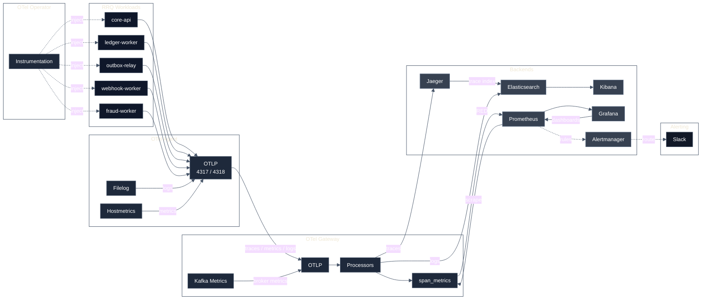
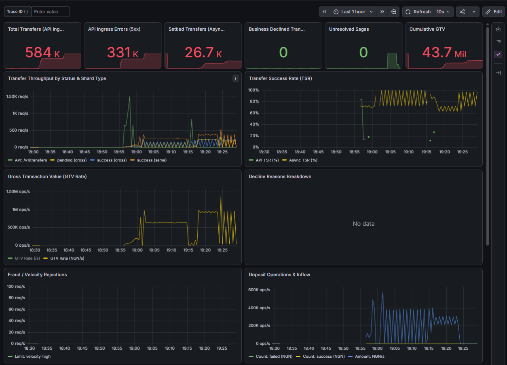
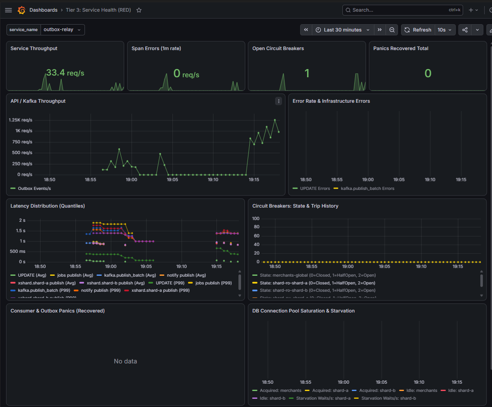

# RRQ Observability Stack

This directory contains the complete observability platform for the **RRQ (River Rust Queue)** payment processing core: OpenTelemetry collection, Prometheus metrics, Grafana dashboards, centralized logging, and distributed tracing — all deployed declaratively via GitOps (Argo CD, Wave 1).

---

## Architecture

This page focuses only on the observability pipeline. For the runtime topology, data flow, and the observability architecture diagram, see the canonical RRQ architecture reference in [the River Rust Queue architecture document](https://github.com/Joel-Ajayi/river-rust-queue/blob/main/docs/ARCHITECTURE.md).

### Data Flow Summary

| Signal      | Collection                                                             | Pipeline                                                                     | Destination                                        |
| ----------- | ---------------------------------------------------------------------- | ---------------------------------------------------------------------------- | -------------------------------------------------- |
| **Traces**  | OTel Agent (`otlp` receiver) receives from auto-instrumented workloads | Agent → Gateway → `otlp/jaeger`                                              | Jaeger (Elasticsearch-backed storage)              |
| **Metrics** | Workload spans, `hostmetrics`, `kubelet_stats`, `kafka_metrics`        | Agent → Gateway → `span_metrics` connector → `prometheus` exporter (`:8889`) | Prometheus → Grafana                               |
| **Logs**    | `filelog` receiver tails `/var/log/pods/*/*/*.log`                     | Agent → Gateway → `elasticsearch` exporter                                   | Elasticsearch (`rrq-logs-%{+yyyy.MM.dd}`) → Kibana |
| **Alerts**  | `PrometheusRule` (`rrq-critical-alerts`)                               | Alertmanager groups by `[alertname, severity]`                               | Slack (`slack-critical`, `slack-warning`)          |

---

## Components

| Manifest                  | Kind                                  | Purpose                                                                                                     |
| ------------------------- | ------------------------------------- | ----------------------------------------------------------------------------------------------------------- |
| `namespace.yaml`          | `Namespace`                           | `observability` namespace isolation                                                                         |
| `agent.yaml`              | `OpenTelemetryCollector` (DaemonSet)  | Node-level collection: OTLP, filelog, hostmetrics, kubelet stats → forwards to gateway                      |
| `agent-rbac.yaml`         | `Role` / `ClusterRole`                | Permissions for agent collectors (kubelet stats, pod metadata)                                              |
| `agent-rbac.yaml`         | `ServiceAccount`                      | `agent` service account                                                                                     |
| `gateway.yaml`            | `OpenTelemetryCollector` (Deployment) | Central pipeline: `span_metrics` connector, `k8sattributes`, fan-out to Jaeger / Prometheus / Elasticsearch |
| `gateway-rbac.yaml`       | `ServiceAccount`                      | `gateway` service account                                                                                   |
| `instrumentation.yaml`    | `Instrumentation`                     | OTel Operator eBPF auto-instrumentation for Go binaries (gRPC `4317`)                                       |
| `servicemonitor.yaml`     | `ServiceMonitor`                      | Prometheus scrapes gateway `:8889` / `/metrics` every 15s                                                   |
| `prometheusrule.yaml`     | `PrometheusRule`                      | Critical SLO alerts (CrashLoopBackOff, 5xx rate, etc.)                                                      |
| `alertmanagerconfig.yaml` | `AlertmanagerConfig`                  | Routing: critical → `slack-critical`, warning → `slack-warning`, critical inhibits warnings                 |
| `jaeger.yaml`             | `OpenTelemetryCollector`              | Jaeger UI (`:16686`) + OTLP receiver, ES-backed                                                             |
| `elastic.yaml`            | `Elasticsearch` / `Kibana` (ECK)      | Log storage (2 nodes) and Kibana UI                                                                         |
| `ops-routes.yaml`         | `HTTPRoute`                           | Exposes observability UIs via Envoy Gateway (Grafana, Kibana, Jaeger)                                       |

---

## Dashboards & SRE Portals

Grafana dashboards follow a **Persona-Driven 5-Tier Taxonomy** (RED + USE methods) and are shipped as labeled `ConfigMap` resources auto-imported by the Grafana sidecar:

| Tier       | Name                           | Target Persona             | Local Kind URL                                        | Production URL                            |
| :--------- | :----------------------------- | :------------------------- | :---------------------------------------------------- | :---------------------------------------- |
| **Tier 1** | Business Transactions & SLOs   | Executive & Product        | `http://grafana.127.0.0.1.nip.io:8080/executive`      | `https://metrics.<domain>/executive`      |
| **Tier 2** | User Journeys & Critical Paths | Architects & Backend Leads | `http://grafana.127.0.0.1.nip.io:8080/journeys`       | `https://metrics.<domain>/journeys`       |
| **Tier 3** | Service Health & RED Metrics   | On-Call Engineers          | `http://grafana.127.0.0.1.nip.io:8080/services`       | `https://metrics.<domain>/services`       |
| **Tier 4** | Middleware & Data Layer USE    | DBAs & Platform SREs       | `http://grafana.127.0.0.1.nip.io:8080/middleware`     | `https://metrics.<domain>/middleware`     |
| **Tier 5** | Compute & Infrastructure USE   | Systems Admins & K8s SREs  | `http://grafana.127.0.0.1.nip.io:8080/infrastructure` | `https://metrics.<domain>/infrastructure` |

See [`dashboards/README.md`](dashboards/README.md) for full panel queries, metric definitions, and capacity engine links.

### Live Dashboard Previews

_Figure 1: Tier 1 Business Transactions & Volume Dashboard (`/executive`) — live GTV, transfer throughput, and settlement rates._

 

_Figure 2: Tier 3 Service Health (RED) Dashboard (`/services`) — live Outbox Relay throughput (1,250 events/s) and circuit breaker state._

---

## GitOps Deployment

- Deployed as part of **Wave 1** by `bootstrap/root-app.yaml` / `overlays/prod/observability`.
- Metric panels map 1:1 to the empirical baseline inputs declared in `tools/capacity-engine/slo-input.yaml`.
