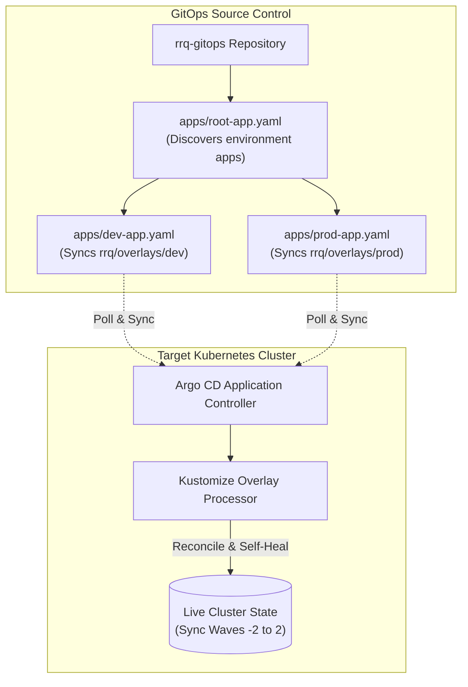

# Infrastructure & GitOps Architecture

This document provides the canonical technical specification for the **RRQ Infrastructure & GitOps control plane** (`rrq-gitops`).

---

## 1. Overview & Operating Model

RRQ infrastructure is strictly managed using **Declarative GitOps** driven by **Argo CD**.

### Core Operating Principles
1. **Pull-Based Synchronization**: Argo CD runs inside the cluster, polling Git for desired state changes. No CI runner or developer holds static cluster admin credentials.
2. **Kustomize Overlays**: Infrastructure bases (`rrq/base/`) are customized for `dev` and `prod` using Kustomize overlays (`rrq/overlays/`).
3. **Automated Self-Healing**: Live cluster resources that drift from Git are automatically overwritten to match the declared Git state.

---

## 2. Argo CD "App of Apps" Pattern

The infrastructure uses a single root Application (`apps/root-app.yaml`) that monitors the `apps/` directory and automatically instantiates environment-specific sub-applications:

- **`apps/dev-app.yaml`**: Manages the local Kind development cluster workloads.
- **`apps/prod-app.yaml`**: Manages DigitalOcean Kubernetes (DOKS) production workloads.

---

## 3. Sync Wave Execution Order

Argo CD Sync Waves guarantee that resources are created in strict dependency order during cluster provisioning:

| Wave | Phase / Target | Responsibilities & Resources |
|---|---|---|
| **`-2`** | Core Security | **Sealed Secrets Controller**. Must run before any encrypted secrets are applied. |
| **`-1`** | Infrastructure Operators | **CloudNativePG**, **Strimzi Kafka**, **KEDA**, **Envoy Gateway**, **cert-manager**, **OTel Operator**. |
| **`0`** | Stateful Clusters & Ops | **PostgreSQL Clusters** (`merchants-db`, `shard-a`, `shard-b`), **Strimzi Kafka Cluster**, **Redis Sentinel**, **kube-prometheus-stack**. |
| **`1`** | Data Provisioning | **Database Migration Jobs** & Seed Data Scripts. Depend on Postgres HA readiness. |
| **`2`** | Microservices | **Application Deployments** (`core-api`, `ledger-worker`, `outbox-relay`, `webhook-worker`, `fraud-worker`, `recon-worker`). |

---

## 4. Managed Infrastructure Operators

### 4.1 CloudNativePG (PostgreSQL 17 HA)
- **Clusters**:
  - `merchants-db`: Global merchant directory & routing table.
  - `shard-a`, `shard-b`: Sharded financial ledger databases.
- **High Availability**: 3 instances per cluster (1 Primary, 2 Standbys) with synchronous WAL replication.
- **Backup Strategy**: Continuous Barman ObjectStore WAL streaming to S3 with 30-day retention for Point-in-Time Recovery (PITR).

### 4.2 Strimzi Kafka (KRaft Mode)
- **Version**: Kafka 3.9+ running in KRaft mode (no ZooKeeper dependency).
- **Topology**: 3 dual-role replicas (`controller` + `broker`).
- **Topics**:
  - `jobs`: Microservice job execution events.
  - `notify`: Webhook event stream (partitioned by `merchant_id` for strict sequence delivery).

### 4.3 Envoy Gateway (Kubernetes Gateway API)
- **Standard**: Implements `gateway.networking.k8s.io` specifications.
- **Capabilities**: Edge TLS termination, HTTPRoute path routing, and edge JWT signature verification (`SecurityPolicy`).

### 4.4 KEDA (Kubernetes Event-Driven Autoscaling)
- **Scaling Triggers**: Scales worker deployment replicas (`ledger-worker`, `webhook-worker`) dynamically based on Kafka topic consumer group lag.

---

## 5. Namespace Architecture

| Namespace | Managed Services | Purpose |
|---|---|---|
| `rrq` | Core services, DB clusters, Kafka, Redis | Application workloads & data layer |
| `argocd` | Argo CD server & controllers | GitOps control plane |
| `observability` | Prometheus, Grafana, OTel collectors, Jaeger, Elastic | Telemetry & alerting |
| `cnpg-system` | CloudNativePG operator | Postgres cluster manager |
| `strimzi-system` | Strimzi operator | Kafka broker manager |
| `envoy-gateway-system` | Envoy Gateway controller | Ingress proxy manager |
| `keda` | KEDA operator | Kafka autoscaler |
| `sealed-secrets` | Sealed Secrets controller | Decrypts in-cluster secrets |
