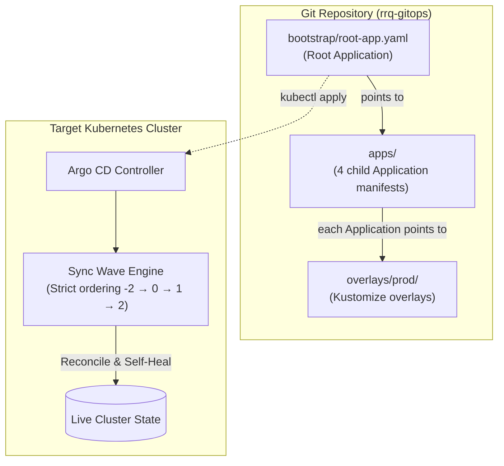

# Infrastructure & GitOps Architecture

This document provides the canonical technical specification for the **RRQ Infrastructure & GitOps control plane** (`rrq-gitops`).

---

## 1. Overview & Operating Model

RRQ infrastructure is strictly managed using **Declarative GitOps** driven by **Argo CD**.

### Core Operating Principles
1. **Pull-Based Synchronization**: Argo CD runs inside the cluster, polling Git for desired state changes. No CI runner or developer holds static cluster admin credentials.
2. **Kustomize Overlays**: Infrastructure bases (`base/`) are customized for `dev` and `prod` using Kustomize overlays (`overlays/`).
3. **Automated Self-Healing**: Live cluster resources that drift from Git are automatically overwritten to match the declared Git state.
4. **Strict Operator/CR Separation**: All CRD-installing operators deploy in Wave -2. Custom Resources that depend on those CRDs deploy in later waves, guaranteeing zero race conditions.

---

## 2. Declarative ApplicationSet Pattern

The infrastructure uses an **Argo CD ApplicationSet** (`bootstrap/root-app.yaml` for production, `bootstrap/root-app-local.yaml` for local production) to declaratively generate the deployment cascade with strict sync-waves across all environments without duplicate manifests:

| Subsystem | Sync Wave | Target Overlay (`prod` / `local`) | Purpose |
|---|---|---|---|
| `sealed-secrets` | `-3` | `overlays/<env>/sealed-secrets` | Secret decryption operator |
| `operators` | `-2` | `overlays/<env>/operators` | CRD installers (CNPG, Strimzi, Envoy, KEDA, cert-manager, ECK, OTel) |
| `gateway` | `-1` | `overlays/<env>/gateway` | Envoy Gateway & HTTP listener infrastructure |
| `datastores` | `0` | `overlays/<env>/datastores` | Stateful databases (PostgreSQL clusters, Kafka, Redis) |
| `observability` | `1` | `overlays/<env>/observability` | OTel pipelines, Elasticsearch, Prometheus, Grafana |
| `workloads` | `2` | `overlays/<env>/workloads` | Application microservices (core-api, workers) & HTTPRoutes |

Argo CD reads the `sync-wave` annotations and deploys them sequentially, **waiting for each wave to become fully Healthy** before proceeding to the next.

### Local Dev Bypass
In local development, Argo CD is **not used**. Running `make bootstrap ENV=dev` directly applies overlays via sequential `kubectl apply -k` calls, preserving the same strict ordering while allowing uncommitted local changes to take effect immediately.

---

## 3. Sync Wave Execution Order

| Wave | Phase | What Deploys | Why This Order |
|------|-------|-------------|----------------|
| **`-2`** | Operators | Sealed Secrets, CloudNativePG, Strimzi Kafka, Envoy Gateway, KEDA, cert-manager, ECK, kube-prometheus-stack, OpenTelemetry Operator | Registers all CRDs first. Must be healthy before any CR is created. |
| **`0`** | Datastores | PostgreSQL Clusters (`merchants-db`, `shard-a`, `shard-b`), Kafka Cluster & Topics, Redis | Stateful services depend on CNPG and Strimzi operators from Wave -2. |
| **`1`** | Observability | OTel Collectors, Grafana Dashboards, ServiceMonitors, PrometheusRules, AlertmanagerConfig, Jaeger, Elasticsearch, Kibana, Portainer, Gateway ops-routes | Monitoring depends on kube-prometheus-stack and ECK operators from Wave -2. |
| **`2`** | Workloads | core-api, ledger-worker, outbox-relay, webhook-worker, fraud-worker, Gateway, HTTPRoutes, SecurityPolicies, Migrations | Application services depend on databases (Wave 0) and Gateway operator (Wave -2). |

### Critical Design Rule: Operator/CR Separation

**All Helm charts that install CRDs live exclusively in `base/platform/operators/`** (Wave -2). Custom Resources that consume those CRDs (e.g., `ServiceMonitor`, `Gateway`, `Cluster`, `Kafka`, `ScaledObject`, `Instrumentation`) live in `observability`, `datastores`, or `workloads` (Waves 0–2).

This eliminates the most dangerous class of GitOps race conditions: attempting to create a Custom Resource before the Kubernetes API has registered its CRD.

---

## 4. Managed Infrastructure Operators

All operators are installed as Helm charts in `base/platform/operators/kustomization.yaml`:

| Operator | Helm Chart | CRDs Registered | Namespace |
|----------|-----------|-----------------|-----------|
| Sealed Secrets | `sealed-secrets` | `SealedSecret` | `kube-system` |
| CloudNativePG | `cloudnative-pg` | `Cluster`, `Pooler`, `Backup` | `cnpg-system` |
| Strimzi Kafka | `strimzi-kafka-operator` | `Kafka`, `KafkaTopic`, `KafkaNodePool` | `strimzi-system` |
| Envoy Gateway | `gateway-helm` | `GatewayClass`, `Gateway`, `HTTPRoute` | `envoy-gateway-system` |
| KEDA | `keda` | `ScaledObject`, `TriggerAuthentication` | `keda` |
| cert-manager | `cert-manager` | `ClusterIssuer`, `Certificate` | `cert-manager` |
| ECK Operator | `eck-operator` | `Elasticsearch`, `Kibana` | `elastic-system` |
| kube-prometheus-stack | `kube-prometheus-stack` | `ServiceMonitor`, `PrometheusRule`, `AlertmanagerConfig` | `observability` |
| OpenTelemetry Operator | `opentelemetry-operator` | `Instrumentation`, `OpenTelemetryCollector` | `observability` |

---

## 5. Namespace Architecture

| Namespace | Managed Services | Purpose |
|---|---|---|
| `rrq` | Core services, DB clusters, Kafka, Redis | Application workloads & data layer |
| `argocd` | Argo CD server & controllers | GitOps control plane |
| `observability` | Prometheus, Grafana, OTel collectors, Jaeger, Elastic | Telemetry & alerting |
| `cnpg-system` | CloudNativePG operator | Postgres cluster manager |
| `strimzi-system` | Strimzi operator | Kafka broker manager |
| `envoy-gateway-system` | Envoy Gateway controller | Ingress proxy manager |
| `keda` | KEDA operator | Kafka autoscaler |
| `kube-system` | Sealed Secrets controller | Decrypts in-cluster secrets |
| `cert-manager` | cert-manager | TLS certificate automation |
| `elastic-system` | ECK operator | Elasticsearch cluster manager |
| `redis` | Redis Sentinel | In-memory cache & idempotency store |
| `portainer` | Portainer | Kubernetes cluster management UI |
