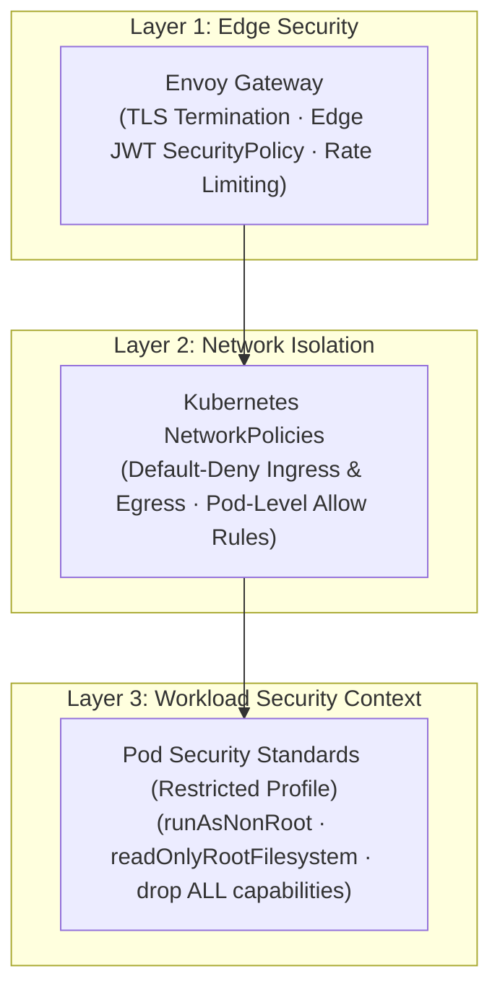

# Infrastructure Security & Network Policy Specification

This document details the security posture, network isolation boundaries, RBAC policies, and secret encryption standards for the RRQ GitOps control plane.

---

## 1. Multi-Layer Security Architecture



---

## 2. Network Policy Matrix

RRQ applies a **Default-Deny Ingress** policy across all namespaces (`rrq`, `observability`, `cnpg-system`). Communication is granted via explicit NetworkPolicy rules:

| Policy Name | Target Selector | Allowed Source | Allowed Ports | Purpose |
|---|---|---|---|---|
| `default-deny-ingress` | `{}` (all pods) | None | None | Blocks all unauthorized ingress by default. |
| `allow-ingress-to-core-api` | `app: core-api` | `namespace: envoy-gateway-system` | `8080` (http), `9090` (metrics) | Permits Envoy Gateway proxy traffic to REST API. |
| `allow-metrics-scrape` | `{}` (all pods) | `namespace: observability` | `9090` (prometheus metrics) | Allows Prometheus server to collect telemetry. |
| `allow-intra-namespace` | `{}` (all pods) | `namespace: rrq` | All internal ports | Permits pod-to-pod communication within `rrq`. |
| `allow-egress-external-webhook` | `app: webhook-worker` | External Internet | `443` (https), `80` (http) | Permits webhook worker to deliver payloads to merchant URLs. |

---

## 3. Secret Management & Encryption at Rest

### Workflow
1. **Plaintext secrets** are created in `secrets/<env>/*.plain.yaml` (git-ignored via `.gitignore`).
2. **Encryption** is performed by `make seal ENV=<env>`, which runs `kubeseal` against the cluster's public sealing key.
3. **Encrypted `SealedSecret` manifests** are written to `overlays/<env>/<component>/secrets.yaml` and are safe to commit to Git.
4. **In-cluster decryption**: The Sealed Secrets controller (deployed in Wave -2) decrypts `SealedSecret` resources into native Kubernetes `Secret` objects inside the target namespace.

### Key Constraint
The Sealed Secrets operator **must be healthy** before any `SealedSecret` can be applied. This is guaranteed by the sync wave architecture: the operator deploys in Wave -2, and secrets are sealed only after `kubectl rollout status` confirms the deployment is ready.

---

## 4. Pod Security Context Standard

All microservices declared in `base/workloads/services/` conform to the Kubernetes **Restricted Pod Security Standard**:

```yaml
securityContext:
  allowPrivilegeEscalation: false
  readOnlyRootFilesystem: true
  capabilities:
    drop:
      - ALL
podSecurityContext:
  runAsNonRoot: true
  runAsUser: 1000
  fsGroup: 1000
```
