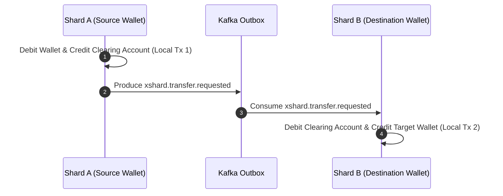

# Questioning Decisions: Core Architecture & Ledger Design

This document explicitly questions every major architectural choice made in RRQ's core engine, detailing **why X was chosen**, **why alternative Y was rejected**, **what trade-offs were accepted**, and **when the decision would be wrong**.

---

## Decision 1: Closed-Loop Ledger vs Open-Loop / External Settlement Core

### Question:
Why build RRQ as a **closed-loop ledger** where money only moves internally between system wallets, rather than integrating external bank and card network settlement directly into the core execution engine?

### Why Closed-Loop Core (Chosen):
1. **Single Database Transaction**: Because both source and destination wallets reside on system-controlled storage, common intra-shard transfers execute in **one serializable PostgreSQL transaction**.
2. **Elimination of Distributed Sagas for 85%+ Traffic**: Eliminates distributed locks, 2PC network round-trips, and complex compensation sagas for intra-shard transfers.
3. **Deterministic Failure Domain**: External bank API drops, ISO 8583 timeouts, and PCI-DSS card network delays are isolated outside the core execution loop.

### Why Open-Loop Integration in Core (Rejected):
Integrating external banking APIs directly inside the transfer loop forces every payment to wait on non-deterministic external network calls ($1\text{s} - 30\text{s}$ latency), introduces non-atomic failure states (bank debited, database crashed), and requires managing complex distributed saga locks across external networks.

### Accepted Trade-offs:
- Money must be deposited into the system (via operator wallet funding) before transfers can occur.
- External payout legs must be handled by separate downstream integration services.

### When this Decision is WRONG:
If the platform's primary requirement is processing direct credit card processing (e.g. Stripe checkout) or instant external wire transfers where money must land in an external bank account synchronously within the primary request latency budget.

---

## Decision 2: 2-Phase Clearing Account Saga vs 2PC / XA Distributed Transactions for Cross-Shard Transfers

### Question:
When a transfer crosses database shards, why use an **asynchronous 2-Phase Clearing Account Saga** instead of two-phase commit (2PC / XA) to atomically update both shards?

### Why 2-Phase Clearing Account Saga (Chosen):

1. **No Distributed Lock Across Network**: Phase 1 locks only Shard A. Phase 2 locks only Shard B. Neither transaction holds database row locks across the network.
2. **High Availability**: If Shard B is temporarily undergoing failover, Shard A still completes Phase 1 cleanly and queues Phase 2 in Kafka.

### Why 2PC / XA (Rejected):
Two-phase commit holds row locks on Shard A while negotiating network consensus with Shard B. If Shard B drops connection or experiences a disk stall during Phase 2, Shard A remains locked indefinitely, cascading lock starvation across the entire cluster.

### Accepted Trade-offs:
- Transfers across shards are **eventually consistent** (Phase 2 completes in $<500\text{ms}$).
- Funds temporarily reside in system clearing accounts during transit.

### When this Decision is WRONG:
If strict real-time ACID consistency across distinct physical database servers is required such that a user must observe the target wallet credited in the exact same database microsecond as the debit.

---

## Decision 3: Postgres `UNIQUE (merchant_id, idempotency_key)` vs Volatile Redis Idempotency Cache

### Question:
Why enforce idempotency using PostgreSQL database constraints rather than a high-performance Redis key-value store?

### Why PostgreSQL Constraint (Chosen):
1. **Durability**: Idempotency records in PostgreSQL are written to write-ahead logs (WAL) and replicated synchronously across HA standby nodes.
2. **ACID Claim**: `INSERT INTO jobs ... ON CONFLICT DO NOTHING` guarantees that idempotency claim and job creation happen in the exact same atomic disk operation.

### Why Volatile Redis Cache (Rejected):
Redis stores keys in memory. During a Redis master crash, failover, or memory eviction under pressure, idempotency keys can be lost. A lost idempotency key causes duplicate payment processing if a merchant retries a request.

### Accepted Trade-offs:
- Idempotency checks require a database disk write/index lookup rather than an in-memory Redis lookup (~2ms vs ~0.2ms).

### When this Decision is WRONG:
If API ingress throughput exceeds 50,000 requests/second and database write capacity is the absolute global system bottleneck.

---

## Decision 4: Row-Level `SELECT ... FOR UPDATE` Locking vs Distributed Redis Redlock

### Question:
Why serialize concurrent access to a wallet using PostgreSQL `SELECT ... FOR UPDATE` row locks instead of a distributed locking algorithm like Redis Redlock?

### Why In-Transaction Database Locks (Chosen):
1. **Engine Enforced**: PostgreSQL guarantees that only one transaction can modify a locked wallet row at a time. The lock releases automatically when the transaction commits or aborts.
2. **No Lock Leakage**: If the worker process crashes, PostgreSQL automatically rolls back the transaction and releases the row lock. Redlock requires explicit TTL expiration, which risks either releasing too early (causing race conditions) or hanging too long after a crash.

### Why Redis Redlock (Rejected):
Redlock relies on clock synchronization across independent Redis nodes. Clock drift or garbage collection pauses in the lock holder can cause Redlock to grant duplicate locks, leading to negative balance race conditions.

### Accepted Trade-offs:
- High transaction velocity against a single popular wallet (e.g. platform fee wallet) creates database lock contention.

### When this Decision is WRONG:
If lock acquisition needs to span non-database resources (e.g. third-party rate limiters or external physical hardware).
