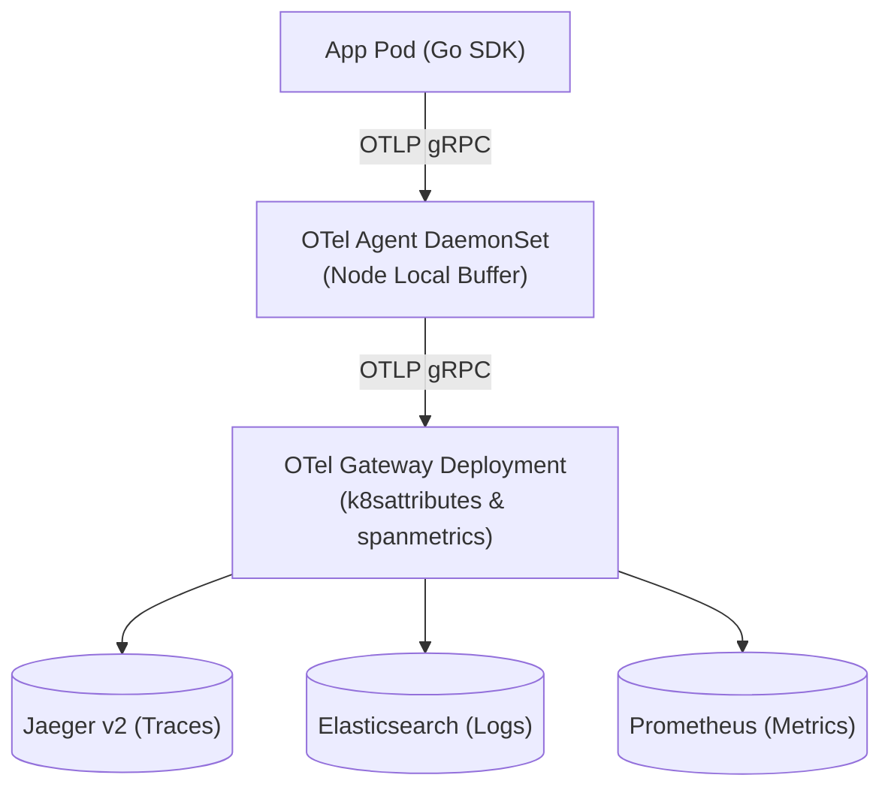

# Questioning Decisions: Observability & SRE Practice

This document explicitly questions every major observability choice made in RRQ, detailing **why X was chosen**, **why alternative Y was rejected**, **what trade-offs were accepted**, and **when the decision would be wrong**.

---

## Decision 1: Three-Tier OpenTelemetry Collector Topology vs Single-Agent Collector

### Question:
Why deploy a **3-tier OpenTelemetry collector topology** (SDK $\rightarrow$ DaemonSet Agent $\rightarrow$ Deployment Gateway $\rightarrow$ Backends) instead of sending telemetry directly from application pods to Prometheus and Jaeger?

### Why 3-Tier Topology (Chosen):

1. **Local Node Buffering**: DaemonSet agents run on every K8s node. If the central gateway or storage backend experiences an outage, local agents buffer spans in memory on the node without causing memory pressure inside application containers.
2. **Centralized Metadata Enrichment**: The gateway deployment enriches spans with Kubernetes pod labels, namespace names, and node IPs centrally, avoiding expensive CPU overhead in every application container.
3. **Derived RED Metrics**: The gateway uses the `spanmetrics` connector to derive Rate, Errors, and Duration metrics from trace spans automatically, guaranteeing RED metrics for 100% of endpoints.

### Why Direct Export / Single Agent (Rejected):
- **Direct App Export**: App containers must manage retry buffers and backend connection pools, risking `OOMKilled` crashes if Jaeger or Elasticsearch is slow.
- **Single Agent**: If the single collector crashes, telemetry from all cluster nodes is immediately lost with no node-level buffering.

### Accepted Trade-offs:
- Managing two OTel collector Kubernetes resources (DaemonSet + Deployment).

### When this Decision is WRONG:
In small, single-node development clusters (e.g. Kind) where running two collector layers consumes node RAM unnecessarily.

---

## Decision 2: Spanmetrics Connector RED Metrics vs Manual Custom Prometheus Instrumentation

### Question:
Why use OpenTelemetry's **`spanmetrics` connector** to derive RED metrics from traces instead of manually instrumenting Prometheus metrics in every HTTP handler?

### Why Spanmetrics Connector (Chosen):
1. **Zero Application Boilerplate**: Automatically generates request rate counters, error counters, and duration histograms for every HTTP route and gRPC method from trace spans.
2. **Guaranteed Metric-Trace Alignment**: Metric labels (`http_route`, `service_name`, `status_code`) match trace span attributes 1:1, ensuring seamless drill-down from Grafana metric panels to Jaeger traces.

### Why Manual App Metrics (Rejected):
Manual metric instrumentation requires developers to add custom Prometheus code to every new endpoint, maintain label consistency across services, and risk label cardinality explosions if un-sanitized parameters are passed to metric labels.

### Accepted Trade-offs:
- Derived metrics are subject to OpenTelemetry trace sampling rates (10% sampling in production).

### When this Decision is WRONG:
For custom high-cardinality business metrics (e.g., `rrq_business_gtv_total` by currency) that are not naturally captured in HTTP span attributes.

---

## Decision 3: Persona-Driven 5-Tier Grafana Taxonomy vs Monolithic Dashboard

### Question:
Why structure Grafana dashboards into a **5-tier persona-driven taxonomy** instead of a single comprehensive dashboard?

### Why 5-Tier Taxonomy (Chosen):
1. **Targeted Information Density**:
   - **Tier 1 (NOC / Exec)**: High-level GTV, TSR %, active alerts.
   - **Tier 3 (On-Call SRE)**: Single RED dashboard with `$service_name` variable dropdown.
   - **Tier 5 (Infra SRE)**: Node CPU/Memory, PVC disk utilization.
2. **Sub-Second Dashboard Rendering**: Smaller, tier-focused dashboards query only relevant metrics, keeping dashboard render times under $500\text{ms}$.

### Why Monolithic Dashboard (Rejected):
Monolithic dashboards attempt to render 100+ panels simultaneously, causing browser freeze, heavy Prometheus query load, and visual confusion during 3am incident response.

### Accepted Trade-offs:
- SREs must navigate between tier dashboards when investigating complex cross-tier incidents.

### When this Decision is WRONG:
In small monolithic applications with only 1-2 services where a single 10-panel dashboard covers the entire system footprint.
