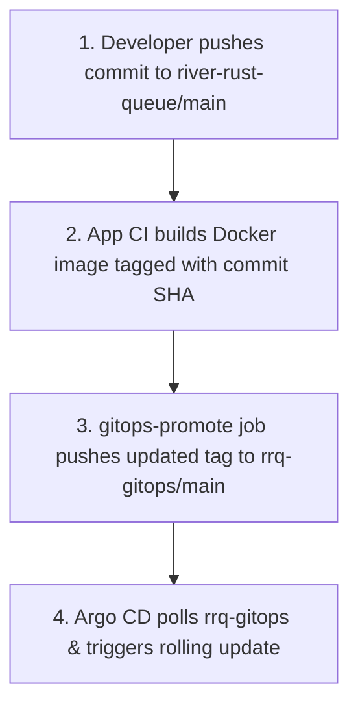

# Questioning Decisions: CI/CD & Operations Pipeline

This document explicitly questions every major deployment choice made in RRQ's CI/CD workflow, detailing **why X was chosen**, **why alternative Y was rejected**, **what trade-offs were accepted**, and **when the decision would be wrong**.

---

## Decision 1: Direct Push to GitOps Repo in CI vs PR-Based Image Promotion

### Question:
Why does the `gitops-promote` job push image tag changes **directly to `main` on `rrq-gitops`** instead of opening a Pull Request for manual merge?

### Why Direct Push to Main (Chosen):

1. **Sub-2-Minute Deployment Velocity**: Pushing directly to `rrq-gitops` triggers Argo CD sync immediately. The entire pipeline from app commit to live deployment completes in $<2\text{ minutes}$.
2. **Immutable Commit SHA Tags**: Container images are tagged with full Git commit SHAs (`ghcr.io/...:abc123...`). There is zero ambiguity about what code is running in production.
3. **Automated Validation Guardrails**: All Go, Rust, and Protobuf breaking tests MUST pass in App CI BEFORE `gitops-promote` executes.

### Why PR-Based Promotion (Rejected):
Opening a Pull Request (via Renovate or Dependabot) for every image build adds 15 to 30 minutes of PR approval latency and developer manual overhead for every single deployment.

### Accepted Trade-offs:
- Manifest changes bypass manual PR review on `rrq-gitops`.

### When this Decision is WRONG:
In regulated banking or medical environments requiring explicit manual dual-signoff on every production deployment PR for compliance.

---

## Decision 2: Commit SHA Image Tags vs Semantic Versioning Tags

### Question:
Why tag container images using **Git Commit SHAs** (`ghcr.io/joel-ajayi/core-api-go:01905335...`) instead of semantic versioning (`v1.2.3`)?

### Why Commit SHA Tags (Chosen):
1. **Immutable Traceability**: Every container image points 1:1 to the exact line of code that compiled it.
2. **Eliminates Manual Version Bump Friction**: Developers do not need to manage `VERSION` files or git tags for routine continuous deployment commits.

### Why Semantic Versioning (Rejected):
Semantic versioning requires manual tag management, risks mutable tag overwrites (`v1.0.0` pushed twice), and provides less precision than exact Git commit hashes.

### Accepted Trade-offs:
- Commit SHAs are 40-character non-human-readable strings (`019053358000...`).

### When this Decision is WRONG:
When publishing library packages or public Docker images intended for external third-party consumer consumption.
